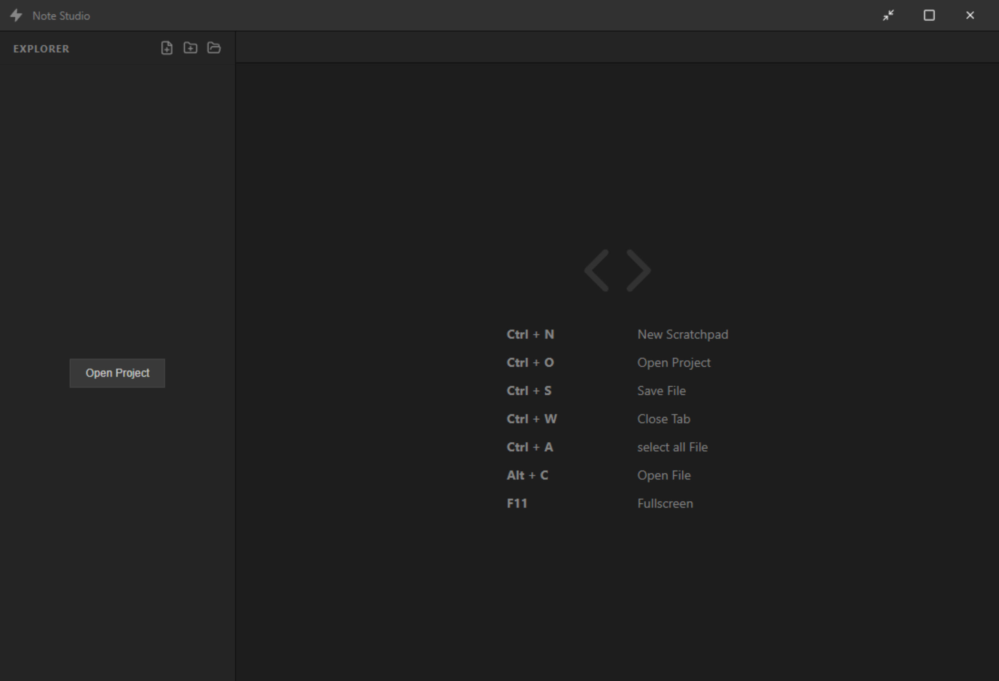
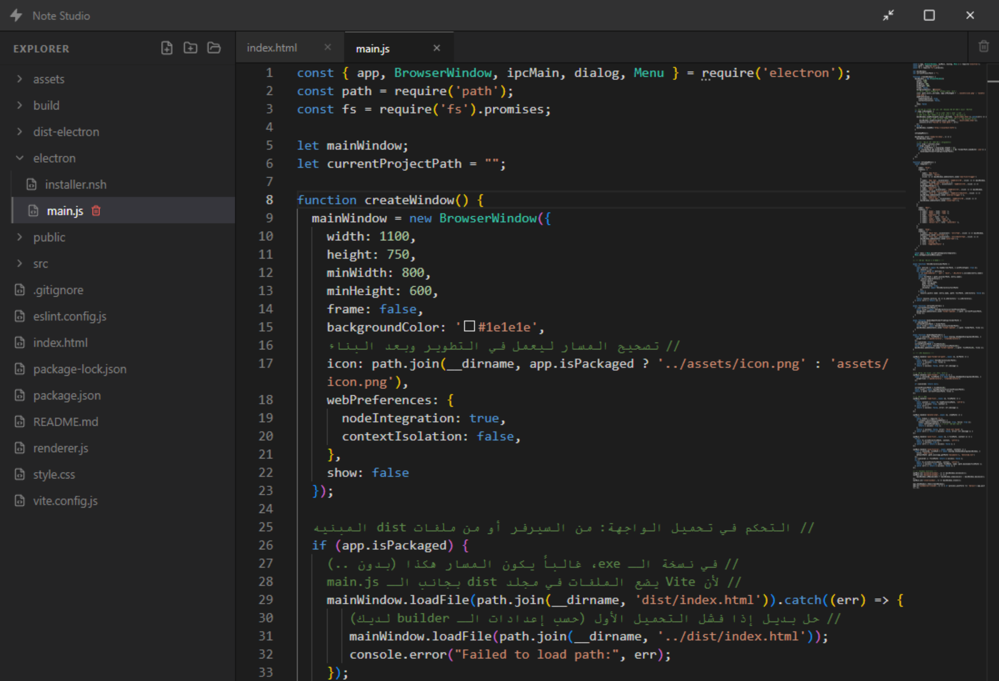

# 📝 NoteAI Studio


> [!WARNING]
> **Demo Version:** This is a preview release and not a final product.
**NoteAI Studio** is a professional, lightweight, and high-performance **Integrated Development Environment (IDE)** built with React and Electron. It provides a sleek, distraction-free environment for developers who value speed and efficiency.

## 🚀 Key Features
* **Monaco Editor Integration:** Powered by the same engine as VS Code, featuring syntax highlighting and smart indentation.
* **Integrated Terminal:** Fully functional terminal (xterm.js) with `node-pty` for direct system interaction.
* **Dynamic File Management:** Tree-view explorer to manage projects and multiple tabs for a seamless workflow.
* **Ultra-Compressed Build:** Optimized using `electron-builder` with maximum compression to ensure a small disk footprint.
* **Keyboard-Centric:** Extensive shortcut support for faster development.
* 



## 🛠 Tech Stack

| Technology | Purpose |
| :--- | :--- |
| **React 18** | UI Components & State Management |
| **Electron** | Desktop Environment Integration |
| **Vite** | Fast Next-Generation Frontend Tooling |
| **Monaco Editor** | Core Text Editing Engine |
| **XTerm.js** | Integrated Terminal Rendering |

## ⌨️ Shortcuts
| **Action,** |Shortcut |
| :--- | :--- |
| **New Scratchpad,** |Ctrl + N |
| **Open Project,** |Ctrl + O |
| **Save File,** |Ctrl + S |
| **Close Tab,** |Ctrl + W |
| **Select All,** |Ctrl + A |
| **Toggle Terminal,** |Alt + R |
| **Fullscreen,** |F11 |

📦 Installation & Development
To run this project locally, follow these steps:
### 1. Clone the repository
```bash
git clone https://github.com/YASSER-27/Note-Studio.git
cd Note-Studio
```
### 2. Install dependencies
```bash
npm install
```
### 3. Run for Development
```bash
npm run dev
```


